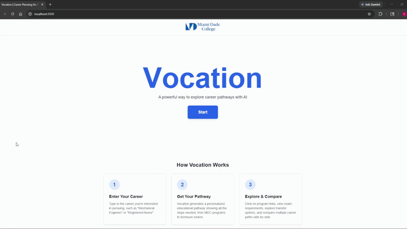

# Vocation

Vocation is an AI-powered planning tool that helps Miami Dade College students see the whole road ahead — from the MDC program they start with all the way to the career they're aiming for.

Picking a major is hard when you can't see where it leads. Most students never get a clear, end-to-end picture of how programs, transfers, licensing exams, and advanced degrees actually fit together. Vocation fills that gap: you type in a career, and it lays out a complete, step-by-step path, with the real MDC programs, transfer options, internships, and certification exams you'll need along the way.




## What it does

- **Career-to-pathway planning.** Enter a career like "Architect" or "Mechanical Engineer" and get a full academic pathway generated for you, starting with the most relevant MDC program.
- **Transfer planning.** See recommended bachelor's and graduate options, partner universities, and articulation details, with links to dig deeper.
- **Licensing and certifications.** Pathways call out the exams and credentials a career actually requires (FE and PE for engineers, NCLEX for nurses, the A.R.E. for architects, and so on), with links to the official sources.
- **Cost estimates.** Each pathway shows a rough tuition-and-fees range, priced per university so a public school and a private one don't look the same. These are estimates only — the app says so, and points you to financial aid resources.
- **Career comparison.** Generate several pathways side by side to weigh different careers against each other.
- **"What fits me" quiz.** Answer a short set of questions and get career suggestions matched to your responses.

## Getting started

### Prerequisites

- Node.js 18.17 or newer (Next.js 14 requires it)
- A Google Gemini API key — you can get one for free at [Google AI Studio](https://aistudio.google.com/app/apikey)

### 1. Clone and install

```bash
git clone https://github.com/<your-username>/Vocation.git
cd Vocation
npm install
```

### 2. Add your API key

Copy the example environment file and paste in your key:

```bash
cp .env.example .env.local
```

Then open `.env.local` and set the value:

```bash
GEMINI_API_KEY=your_actual_key_here
```

Every AI feature — pathway generation, career suggestions, the quiz, and exam lookups — runs through this key. Without it, those routes return `"API key not configured"`. The `.env.local` file is gitignored, so your key never gets committed.

### 3. Run it

```bash
npm run dev
```

Then open [http://localhost:3000](http://localhost:3000).

### 4. Optional: pre-generate the common careers

```bash
# terminal 1 — dev server with seeding enabled
SEED_MODE=1 npm run dev          # PowerShell: $env:SEED_MODE=1; npm run dev

# terminal 2
npm run seed
```

This walks the canonical career list, generates each pathway once, and writes the results to `data/seed-cache.json`. Those results are committed to the repo and served instantly to everyone afterward, so visitors never wait on a generation and the API key is never charged for a career that's already been covered. Re-running the script skips whatever is already in the file, so an interrupted run can just be started again.

### A note on rate limits and cost

The app uses Gemini's Flash model (`gemini-flash-latest` by default). On the free tier, Google caps how many requests you can make per minute, and a search that isn't already cached makes several calls (the pathway, then a lookup for each exam).

Three things keep that under control:

- **The seed file** (`data/seed-cache.json`) answers common careers with no API call at all.
- **An in-memory cache** covers repeats within a running server.
- **Rate limiting** in `app/lib/rateLimit.ts` caps requests per IP and enforces a daily ceiling on total generations, configurable in `app/api/rate-limit-config.ts`. Cached and seeded answers don't count against either limit.

The rate limiter keeps its counters in process memory, so on a serverless host each instance counts separately and the limits are approximate. If you deploy this publicly, set a billing budget cap in Google Cloud — that's the only hard guarantee against a surprise bill.

## Scripts

| Command | What it does |
| --- | --- |
| `npm run dev` | Start the development server |
| `npm run build` | Create a production build |
| `npm run start` | Serve the production build |
| `npm run lint` | Run the linter |
| `npm run seed` | Pre-generate pathways for the common careers into `data/seed-cache.json` |
| `npm test` | Run the test suite |
| `npm run test:watch` | Run tests in watch mode |

## How it's built

- **Next.js 14** (App Router) with **React** and **TypeScript**
- **Tailwind CSS** for styling
- **Google Gemini API** for generating pathways, suggestions, and exam details
- **Vitest** for unit tests

The curated MDC program catalog, certification data, and university list live in `app/lib`, and the Gemini calls are handled server-side in `app/api` so the API key is never exposed to the browser.

Two pieces are worth calling out because they're what keeps the app fast and cheap:

- **`app/lib/careerCanonical.ts`** resolves free-text input to one canonical title, so "nurse", "Nurse", "RN", "nursing", and "I want to be a nurse" all share a single generated pathway instead of producing five. The synonym table it reads is `app/lib/careerAliases.ts`, and it's deliberately conservative — careers only collapse together when they genuinely share a degree and licensing route.
- **`app/lib/apiCache.ts`** layers a committed seed file over an in-memory cache. The seed layer matters on serverless hosts, where route handlers run in short-lived processes with a read-only filesystem and the in-memory layer is wiped on every cold start.

## Project status

Vocation started as a Miami Dade College hackathon project and is still evolving. The pathway generation, comparison, cost estimates, and quiz all work today. Planned next steps include richer visualizations (timelines and charts) and continued tuning of the pathway and cost accuracy.

## Disclaimer

Pathways and cost figures are AI-generated estimates and can contain inaccuracies. They're meant as a starting point — always confirm the details with an MDC academic advisor before making decisions.
